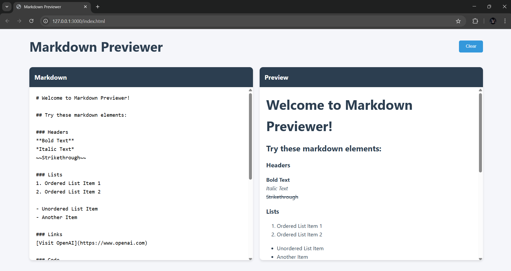
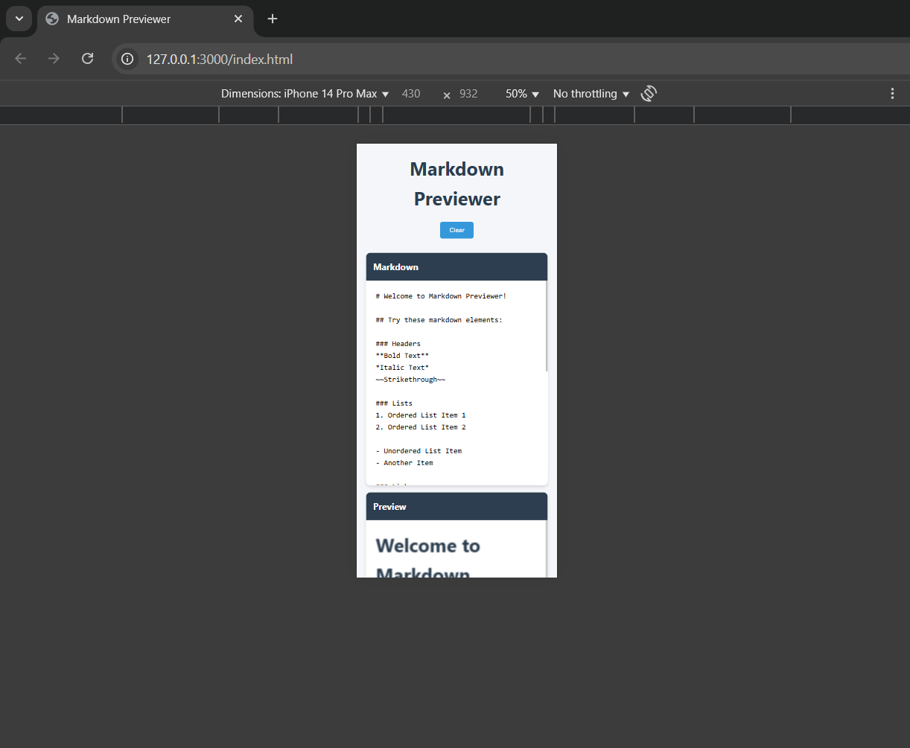

# Markdown Previewer  

A simple real-time Markdown previewer built with HTML, CSS, and JavaScript. This app allows users to write Markdown in a textarea and see the formatted output instantly.  

## 🚀 Features  

✅ Live Markdown preview as you type  
✅ Supports:  
- Headings (`# H1`, `## H2`, etc.)  
- Bold (`**bold**`), Italics (`*italic*`)  
- Links (`[title](http://example.com)`)  
- Ordered & Unordered lists  
✅ Clear/reset button to erase input  
✅ Uses [Marked.js](https://github.com/markedjs/marked) for parsing  
✅ BONUS: Supports code blocks with syntax highlighting  

## 📸 Screenshots  

### Markdown Previewer UI

### Live Editing Example

## 🌐 Live Demo  

[Click here to try it out!](https://markdown-previewer-two-amber.vercel.app/)  

## 🛠️ Tech Stack  

- HTML  
- CSS  
- JavaScript  
- [Marked.js](https://marked.js.org/)  

## 📥 Installation & Usage  
1. Open `index.html` in your browser  
2. Start typing Markdown and see the preview in real time!  

## 🎯 Contribution  

Feel free to fork this repo and submit pull requests! 🚀  

